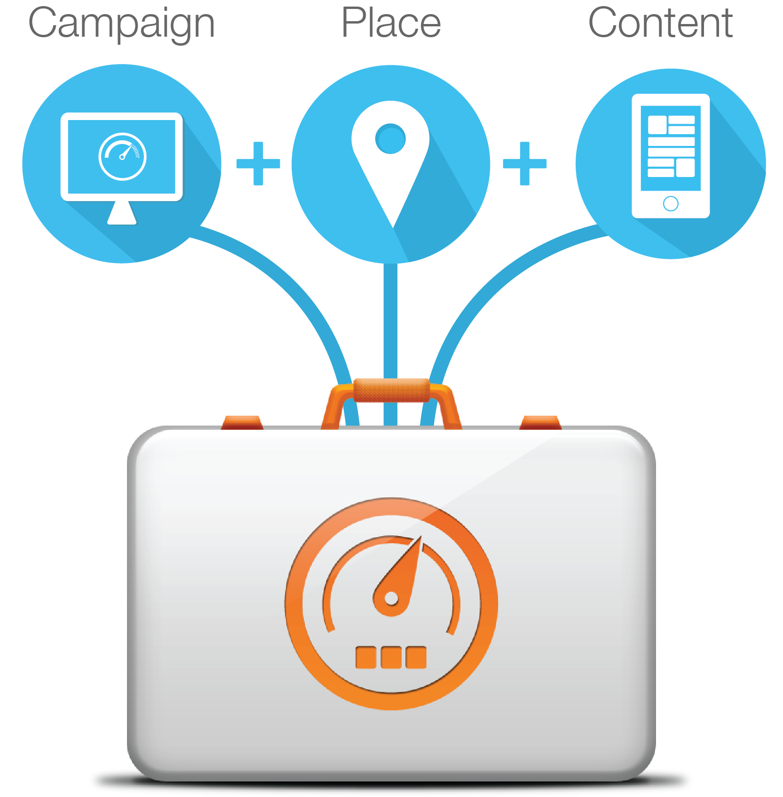
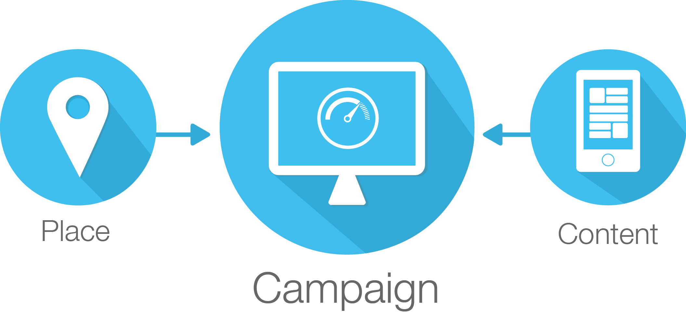
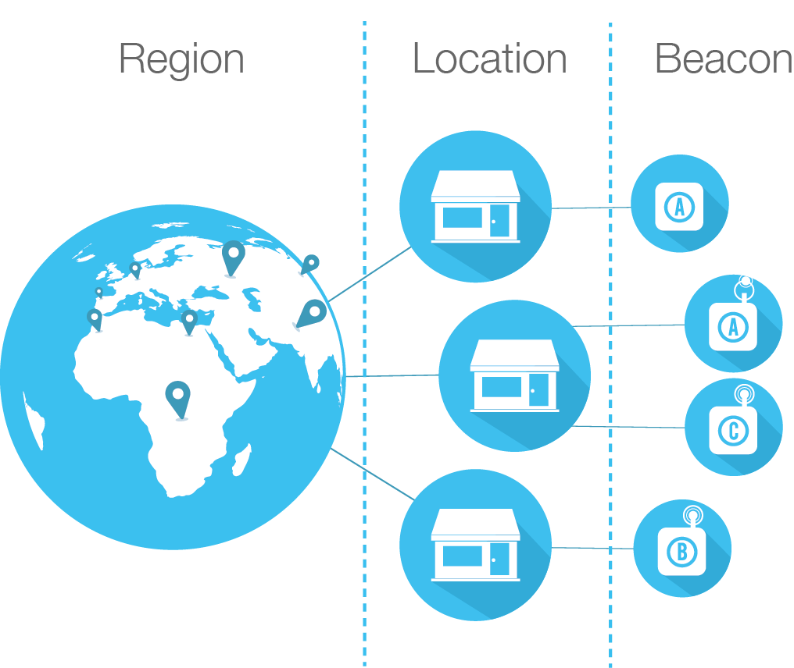
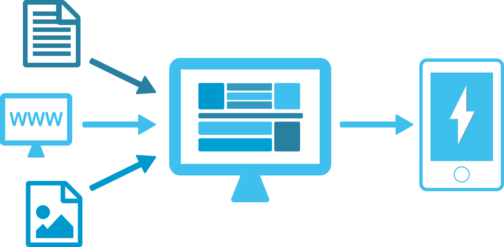

Campaign Kit is a cloud based service coupled with mobile SDKs that allows users to deliver targeted campaigns to mobile devices within proximity of any place.

# iOS Documentation
* [Download & Release Notes](https://github.com/RadiusNetworks/campaignkit-ios/releases/latest)
* [Getting Started](http://developer.radiusnetworks.com/campaignkit/ios/AppleDocs/docs/Docs/How-To.html)
* [SDK Documentation](http://developer.radiusnetworks.com/campaignkit/ios/AppleDocs/index.html)
* [Notes on suppressing multiple notifications](http://developer.radiusnetworks.com/campaignkit/ios/suppressing-multiple-campaigns.html)

# Android Documentation
* [Download & Release Notes](https://github.com/RadiusNetworks/campaignkit-android/releases/latest)
* [Getting Started](http://developer.radiusnetworks.com/campaignkit/android/How-To.html)
* [JavaDocs](http://developer.radiusnetworks.com/campaignkit/android/javadocs/index.html)
* [Notes on suppressing multiple notifications](http://developer.radiusnetworks.com/campaignkit/android/suppressing-multiple-campaigns.html)

# What is a Kit?
Kit is the high level container encompassing all the required resources you'll need to
create and deliver powerful campaigns.

Kit allows you to bundle your content to your places and define campaign logistics.
Although most will find having a single Kit to be adequate,
the ability to have multiple Kits allows you the flexibility to separate and
differentiate campaigns to your target audience.
This facilitates better control, maintenance, and operation of your campaigns.

Click on a Kit in the left column navigation menu to uncover more details on Campaigns,
Places, and Content in their respective sections. If you don't have a Kit yet or want to
add another click the Add Kit button.

# What is a "Campaign"?
Campaigns are the packaging of the content, including textual and media assets,
that will be offered in the places associated to your campaign.

The components comprising a campaign are modular, allowing for the underlying places
and content resources of a campaign to be edited without having to edit the actual campaign.
This modularity allows for fantastic reuse of previously defined resources,
enabling rapid creation and swift delivery of your campaign to all of your target audience.

Campaigns are available during the start and stop times defined in a campaign when active.

# What is a "Place"?
Places define which locations, when in proximity, will trigger your campaigns to be
rendered to your mobile audience. When you create a campaign it can be connected to
any of your defined places.

When you choose a place to associate with a campaign, you are really selecting a hierarchy
of places to associate. The interface allows you to define such a hierarchy of places.

For example, you may want to define a top level place named "North America Region".
Under that you could create a place for each location facility that will be part of your region.
And finally you will need to define each beacon that belongs to each location.

# What is "Content"?
Content is the collection of textual and media assets that are available to be attached to
campaigns and presented to the user based on the behavior defined by the campaign event logic.

Content allows you to define a rich HTML-based layout incorporating your media to deliver a
fully engaging experience in your campaign. Content allows you the flexibilty to present your
campaign as a lightweight mobile notification or as a full rich textual and media view rendered
in the mobile application.

Media assets may consist of images, audio, or video. The content can be created and managed
independenty from the campaign. Existing content can be reused in a new campaign or updated for
use in new campaigns.
